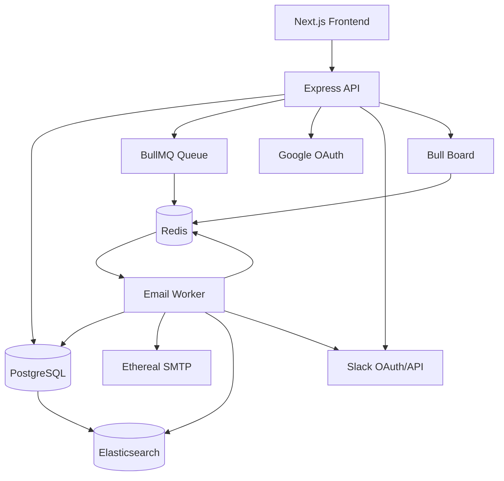

# Architecture

This document explains **how the ReachInbox email scheduler works**: what each
component is responsible for, how data flows through the system, and how the
hard constraints from the assignment (no cron, restart-safe, idempotent,
rate-limited) are actually satisfied in the design.

For **why** each choice was made instead of an alternative, see
[`decision.md`](./decision.md). For **how the build is sequenced**, see
[`plan.md`](./plan.md). This document does not repeat the reasoning behind a
choice beyond what is needed to understand the mechanism.

---

## Overview

The system is a monorepo with two runtime processes that share state through
Postgres and Redis, plus a Next.js frontend:

- **Express API** — accepts requests, writes rows, enqueues jobs.
- **BullMQ worker** — consumes jobs, enforces rate limits, sends mail, updates
  rows, indexes into search.
- **Next.js dashboard** — login, compose, and the Scheduled/Sent views.

The single governing principle is:

> **PostgreSQL owns application state. Redis/BullMQ owns job timing and
> delivery.**

Concretely, this means:

- A BullMQ job is never the only record that an email should be sent — it is
  a **wake-up call**. The row in Postgres is what actually says what to send,
  to whom, and what has already happened to it.
- A job's payload is minimal (an email id). The worker always re-reads the
  row before acting, so a stale or duplicated job cannot resend stale
  content.
- Every side effect that matters for correctness (has this email been sent?
  has this sender exceeded its hourly cap?) is backed by a durable store
  (Postgres or Redis), never by in-process memory, because there can be more
  than one worker process.
- Hitting a limit **reschedules** work; it never drops or fails it silently.

This principle is what makes the two hardest requirements — surviving a
restart, and never double-sending — tractable: as long as Postgres and Redis
are durable, the API and worker processes are disposable.

---

## Architecture diagram



Two adjustments from the sketch in the brief, both because they reflect the
actual dependency direction rather than a stylistic choice:

- `QUEUE --> REDIS` and `REDIS --> WORKER` replace a single `API --> REDIS`
  and `QUEUE --> WORKER` edge: BullMQ's queue object is a thin client over
  Redis, and the worker polls Redis directly rather than being called by the
  queue. Drawing `API --> REDIS` directly would suggest the API talks to
  Redis for something other than enqueueing, which it doesn't.
- `WORKER --> SLACK` is added alongside `API --> SLACK`: the API only handles
  the OAuth install/callback/status/disconnect routes; the actual
  rate-limit notification is posted by the worker, which is the process that
  detects the limit being hit.

---

## Component responsibilities

**Frontend (Next.js).** Renders `/login` and `/dashboard`, holds no business
logic beyond form validation and CSV parsing, and talks to the API exclusively
through a typed fetch client that carries the session cookie.

**Express API.** The only writer of `campaigns`, `senders`, and the initial
`emails` rows. Owns Google and Slack OAuth flows, session issuance, and the
read endpoints (`/emails`, `/emails/search`, `/senders`). Never sends mail and
never enforces rate limits itself — it only creates rows and enqueues jobs.

**PostgreSQL.** The single source of truth for what should happen and what
has happened: users, senders, campaigns, every individual email, the durable
audit of hourly usage, and Slack connections. Every other store (Redis,
Elasticsearch) can be rebuilt from Postgres; Postgres cannot be rebuilt from
them.

**Prisma.** The typed data-access layer over Postgres, used identically by
the API and the worker process. Migrations are the single source of schema
truth, checked into the repo.

**Redis.** Backs three distinct uses, kept in separate key spaces so they can
be reasoned about independently: BullMQ's job storage (delayed set, waiting
list, active/completed/failed lists), the per-sender hourly rate counters
(`rate:{senderId}:{hourWindow}`), and the per-sender minimum-delay lock. Redis
is configured with AOF persistence so this state survives a Redis restart,
not only an API/worker restart.

**BullMQ.** The delayed-job mechanism that replaces cron. One job per email,
job id equal to the email id, delay computed as `scheduled_at - now` at
creation time. BullMQ moves a job from its delayed set into the waiting list
when the delay elapses; the worker never polls "is it time yet?" itself.

**Worker.** The only process that sends mail. For each job: re-reads the row,
atomically claims it (`scheduled → processing`), checks the per-sender rate
limit and minimum delay, sends through Ethereal, and records the outcome
(`sent`/`failed`) plus an Elasticsearch update. On limit or lock contention it
reschedules rather than sending. Runs its own boot-time reconciliation pass
(see [Persistence and restart recovery](#persistence-and-restart-recovery)).

**Ethereal.** A fake SMTP provider used through Nodemailer. Each `sender` row
holds its own Ethereal test account, so the system genuinely supports
multiple independent senders rather than simulating them with one mailbox.
Every send yields a preview URL, stored on the email row for the Sent table.

**Elasticsearch.** A read-side search index over emails, kept eventually
consistent with Postgres. It is explicitly **not** the source of truth: if it
is down or falls behind, sending and scheduling are unaffected, and search
simply degrades or returns stale results until it recovers (see
[Elasticsearch](#elasticsearch)).

**Google OAuth.** Authenticates dashboard users. Produces the session cookie
that protects every other API route.

**Slack OAuth.** Lets a user connect a Slack destination for rate-limit
alerts. Entirely optional at runtime — its absence changes notification
behavior, not scheduling or sending behavior.

**Bull Board.** A read-only, admin-gated live view of the BullMQ queues,
mounted on the API process at `/admin/queues`.

---

## Data model

Seven tables, described here by role and relationship rather than as a full
DDL listing (the Prisma schema is the authoritative field list). The
seventh, `idempotency_keys`, was added per ADR-018, after the original six;
see that ADR for why it's a table rather than a Redis key.

```text
users                one row per Google-authenticated account
senders              one row per Ethereal SMTP identity, belongs to a user
campaigns            one row per compose action, belongs to a user and
                     exactly one sender (selected at creation — see
                     "Sender selection" below and ADR-019), and carries its
                     own scheduling controls (start_at,
                     delay_between_emails_ms, hourly_limit — ADR-021,
                     ADR-022): the compose UI's start time, delay, and
                     hourly limit fields are functional, not decorative
emails               one row per recipient, belongs to a campaign and a
                     sender (inherited from the campaign's sender at
                     creation, never chosen independently)
rate_windows         durable audit of hourly sends, belongs to a sender
slack_connections    one row per user's Slack OAuth result
idempotency_keys     one row per Idempotency-Key seen on POST /campaigns,
                     scoped to the user who sent it (ADR-018)
```

Relationships: a `user` has many `senders`, many `campaigns`, and many
`idempotency_keys`; a `sender` has many `campaigns` and (through them) many
`emails`; a `campaign` belongs to exactly one `sender` and has many `emails`;
each `email` belongs to exactly one `sender` (the sender it will be, or was,
sent from — always its campaign's sender); a `sender` has many
`rate_windows` (one per hour it has been active in); a `user` has at most
one `slack_connections` row.

**`emails` is the core entity.** One row = one recipient of one campaign = one
BullMQ job. Everything about throughput, idempotency, and the dashboard views
is really a statement about this table.

Key columns: `id`, `campaign_id`, `sender_id`, `to_email`, `scheduled_at`,
`status`, `sent_at`, `attempts`, `error`, `message_id`, `preview_url`,
`job_id`.

`campaigns` additionally carries `sender_id` (the single sender selected at
creation — ADR-019) and three **required, non-null** scheduling-control
columns: `start_at`, `delay_between_emails_ms`, `hourly_limit` (ADR-021,
ADR-022). These are resolved once at creation — from the user's compose-UI
input, or from the `MIN_DELAY_MS` / `MAX_EMAILS_PER_HOUR_PER_SENDER`
defaults when not customized — and then persisted; a campaign never falls
back to reading the live environment variable after it's created.
`idempotency_keys` carries `id`, `key`, `user_id`, `campaign_id`,
`response_body`, `created_at` (ADR-018).

Constraints and indexes that carry real weight:

- `emails(job_id)` **unique** — makes "the same BullMQ job can only ever map
  to one row" a database-enforced fact, not just a convention.
- `emails(campaign_id, to_email)` **unique** — re-submitting the same
  campaign payload (e.g. a retried `POST /campaigns`) cannot create a second
  row for the same recipient.
- `emails(status, scheduled_at)` — the index the dashboard's Scheduled/Sent
  lists and the boot-time reconciliation query both use.
- `rate_windows(sender_id, window_start)` **unique** — one durable counter
  row per sender per hour; this table is an audit trail, the live counter
  during the hour is the Redis key described in
  [Hourly rate limiting](#hourly-rate-limiting).
- `idempotency_keys(user_id, key)` **unique** — the Idempotency-Key header
  is scoped to the authenticated user, not global; see ADR-018.

**Email lifecycle.**

```text
scheduled
    ↓  (worker claims the row)
processing
    ↓
  sent / failed

processing
    ↓  (rate limit hit)
scheduled            ← scheduled_at moved into the next window
```

`scheduled → processing` is the only transition the worker performs before
doing anything externally visible (checking limits, sending mail). All other
transitions happen after the outcome is known. There is no `processing →
processing`: a row that is rate-limited on its way out of `processing` goes
straight back to `scheduled`, never stays "in progress" while waiting.

---

## Scheduling architecture

```text
POST /campaigns  { senderId, subject, body, recipients[],
                    startAt?, delayBetweenEmailsMs?, hourlyLimit?, ... }
  → look up Idempotency-Key in idempotency_keys (ADR-018)
      → hit: return the stored response, do nothing else
  → validate senderId belongs to the authenticated user (ADR-019)
      → fails: reject before any row is written
  → resolve scheduling controls (ADR-021, ADR-022):
      start_at              = startAt ?? now
      delay_between_emails_ms = delayBetweenEmailsMs ?? MIN_DELAY_MS
      hourly_limit          = hourlyLimit ?? MAX_EMAILS_PER_HOUR_PER_SENDER
      (resolved values are what gets written below — never a live
       fallback to the env var after this point)
  → one PostgreSQL transaction
      → campaign row inserted, with sender_id = senderId and the
        resolved start_at / delay_between_emails_ms / hourly_limit
      → one email row per recipient inserted (status = scheduled),
        sender_id inherited from the campaign — never chosen per-recipient;
        scheduled_at = campaign.start_at + (ordinal position *
        campaign.delay_between_emails_ms), the same order-preserving
        offset logic ADR-008 uses for reschedules, applied here as the
        initial placement
  → transaction commits
  → one BullMQ job per email row, added with addBulk
      → job id = email id
      → delay = scheduled_at - now (ms)
  → Redis stores each job in its delayed set
  → at delay expiry, Redis moves the job to the waiting list
  → an idle worker picks it up and processes it
  → response recorded in idempotency_keys, keyed by (user_id, key)
```

**Sender selection.** A campaign has exactly one sender, chosen explicitly by
the user — never picked implicitly on the backend (ADR-019). The frontend
compose flow's sender selector is populated from `GET /senders`; the chosen
`senderId` travels in the `POST /campaigns` body and becomes both
`campaigns.sender_id` and every one of its emails' `sender_id`. Sender
records themselves are still created only via the Phase 2 seed/development
mechanism — there is no `POST /senders` endpoint.

Rows are committed **before** jobs are enqueued, not inside the same
transaction as the enqueue call — Postgres cannot roll back a Redis write, so
the ordering that matters is "the row exists first." If the `addBulk` call
fails partway, the affected rows simply stay `scheduled` with no live job;
the boot-time reconciliation pass (next section) re-enqueues them on the next
worker start, using the same job-id-equals-email-id rule to make that
re-enqueue safe to repeat.

**No cron is used, anywhere.** There is no `crontab` entry, no `node-cron`,
no `setInterval` polling loop that decides "is it time to send X". The only
mechanism that determines *when* a job runs is BullMQ's delayed-job feature:
each job carries its own due time, computed once, and Redis (via BullMQ's
internal delayed-job processor, which is driven by sorted-set scores and
Redis's own clock, not by an OS scheduler) is what moves it into the waiting
list at the right moment.

Why a BullMQ delayed job satisfies the "no cron" requirement structurally,
not just by omission: cron (and cron-like polling) works by periodically
asking "what's due now?" against the *entire* set of pending work, on a fixed
tick. A BullMQ delayed job instead is scheduled once, individually, to become
runnable at a specific timestamp — there is no periodic scan, no fixed tick
interval, and no coupling between how many jobs exist and how the "when" is
determined. Reconciliation (below) is not an exception to this: it runs once,
at process boot, to repair state after a crash — it is not a recurring timer
that drives normal scheduling.

---

## Persistence and restart recovery

Three durability guarantees compose to make a restart a non-event:

- **PostgreSQL durability.** Every email row and its status is committed
  before the API responds. A crash of the API or worker process loses
  nothing here — the row is already on disk.
- **Redis persistence.** Redis is run with AOF enabled (or the Redis
  container's data directory is a mounted volume in `docker-compose.yml`),
  so BullMQ's delayed jobs survive a Redis restart, not only an
  API/worker restart.
- **BullMQ delayed jobs.** A job's due time is stored data, not a live
  timer in process memory. A worker that restarts does not need to
  "remember" what it was about to do — it re-reads its due jobs from Redis.

**Worker restart.** On boot, before taking any new jobs, the worker runs a
reconciliation pass against Postgres (see below), then starts consuming the
queue normally. In-flight jobs that were `active` when the process died are
retried according to BullMQ's stalled-job detection, which is safe because
the claim step (`scheduled → processing`) and the resend logic are both
idempotent.

**API restart.** The API is stateless between requests; restarting it has no
effect on already-enqueued jobs, which live in Redis and are driven entirely
by the worker.

**Reconciliation on boot** (worker only) runs two queries:

1. **Scheduled rows without a live job.** `SELECT * FROM emails WHERE status
   = 'scheduled'` joined against a check of whether `job_id` still exists in
   BullMQ. Any row whose job is missing (the `addBulk` call partially failed,
   or Redis lost data despite persistence) is re-enqueued with the same job
   id.
2. **Stuck `processing` rows.** Any row that has been `processing` for
   longer than a generous timeout (e.g. 10 minutes — far longer than a send
   should ever take) is assumed to belong to a worker that died mid-send. It
   is moved back to `scheduled` with `scheduled_at = now`, so it is retried
   rather than lost. If a `message_id` is already present on the row, this
   is exactly the ambiguous case described in
   [Idempotency](#idempotency), and it is logged as such rather than
   silently resent as if nothing had happened.

Because both queries key off the row (Postgres), not off Redis's view of the
world, this reconciliation is correct even if Redis itself was wiped: every
`scheduled` row with no matching job gets a fresh one.

---

## Idempotency

Idempotency is enforced at three layers, each catching a different failure
mode.

**BullMQ job id = email id.** Adding a job with an id that already exists in
the queue is a no-op in BullMQ. This makes "enqueue this email's job" safe to
call more than once — from the initial `addBulk`, from reconciliation, or
from a retried request — without needing an separate existence check.

**Unique constraints in Postgres.** `emails(job_id)` unique and
`emails(campaign_id, to_email)` unique turn "don't create the same email
twice" into a database-enforced invariant rather than an application-level
convention that a future code change could quietly break.

**Atomic status transition (`scheduled → processing`).** Before doing
anything externally visible, the worker runs:

```sql
UPDATE emails
SET status = 'processing', attempts = attempts + 1
WHERE id = $1 AND status = 'scheduled'
RETURNING *;
```

If this affects zero rows, the job exits immediately — some other execution
of this job (a duplicate delivery from BullMQ's own at-least-once semantics,
or a manually re-triggered job) already claimed it, and this one has no work
to do. Because the `WHERE status = 'scheduled'` guard and the write happen in
one statement, there is no window between "check" and "act" for two workers
to race through.

**Duplicate BullMQ jobs.** BullMQ guarantees at-least-once execution of a
given job, not exactly-once — a job can be delivered to a worker more than
once (e.g. after a stalled-job timeout). The atomic claim above is what turns
"delivered twice" into "executed once": the second delivery finds the row
already `processing` (or `sent`) and exits without sending.

**Duplicate API requests (`Idempotency-Key`).** `POST /campaigns` accepts an
`Idempotency-Key` header. The API stores a mapping from that key to the
resulting `campaignId` and response body in the `idempotency_keys` table,
scoped to the authenticated user via a `(user_id, key)` unique constraint —
Postgres, not Redis, is authoritative here so the guarantee survives an API
restart or a Redis data loss event (ADR-018). A repeated request with the
same key returns the stored response without re-inserting rows or
re-enqueueing jobs. This protects against client-side retries (a flaky
network causing the browser to resubmit) at the request level, above and
below the row-level protection from the unique constraints.

**The SMTP/DB crash window — stated honestly.** There is one sequence this
design does not make impossible, only detectable:

> A crash after Ethereal/SMTP accepts the message but before PostgreSQL
> records `status = 'sent'` leaves the row in `processing` while the email
> has, in fact, already been sent. This is an inherent property of any
> two-system handoff (send, then record) that isn't wrapped in a distributed
> transaction — no amount of retry logic on the sending side changes that the
> failure can occur in the gap between the two calls.

This system does **not** claim mathematically guaranteed exactly-once
delivery, because that claim would be false. What it does instead:

- The SMTP `Message-ID` returned by Ethereal is written to the row
  immediately after the send call succeeds, as its own statement —
  deliberately **separate** from, and immediately followed by, the
  statement that sets `status = 'sent'`. This is not incidental: a single
  combined write would make the two crash outcomes below indistinguishable,
  since Postgres's own atomicity means such a write either fully lands (the
  row becomes `sent`) or not at all (`message_id` never gets set) — quietly
  collapsing the "possibly already sent" case into the "safe to retry" case
  the mechanism exists to tell apart. With two sequential writes: a crash
  **before** the first one leaves the row `processing` with no
  `message_id`; a crash **between** the two leaves `message_id` set but
  `status` still `processing` — a narrow window, but a real and detectable
  one.
- The stuck-`processing` reconciliation pass (above) distinguishes exactly
  those two cases when it finds a stale `processing` row: no `message_id`
  present means the send itself likely never completed, and it is safe to
  retry; a `message_id` present but `status` still `processing` means the
  send completed but the status write did not, which is logged as an
  ambiguous delivery for manual review rather than blindly resent (resending
  here risks a real duplicate email to a real recipient, which the
  reconciliation logic treats as the worse outcome of the two).

In short: the system is **at-most-once in normal operation**, and the one
window where that can't be guaranteed is detected and surfaced rather than
hidden. See ADR-017 for the full reasoning.

---

## Concurrency

Worker concurrency is BullMQ's own `concurrency` option on the `Worker`
constructor, read from configuration:

```env
WORKER_CONCURRENCY=5
```

This controls how many jobs a single worker process will process in
parallel (not how many worker processes exist — the design supports running
several worker processes too, each with its own `WORKER_CONCURRENCY`).

**Why this is safe with multiple jobs — and multiple workers — running in
parallel:** nothing that matters for correctness lives in worker memory.
Every point of contention has an atomic, durable guard:

- The row claim (`scheduled → processing`) is a single conditional SQL
  statement, safe under any number of concurrent callers.
- The per-sender minimum delay is a Redis lock, not an in-process mutex —
  two concurrent jobs for the same sender, whether in the same worker
  process or different ones, contend for the same Redis key.
- The hourly counter is a Redis Lua script, atomic by construction (see
  below) — two workers cannot both read "199" and both increment to 200.

Raising `WORKER_CONCURRENCY`, or running a second worker process, therefore
only changes throughput, never correctness.

---

## Minimum send delay

```env
MIN_DELAY_MS=2000
```

This is enforced with a **Redis-backed per-sender lock**, not
`setTimeout`/`sleep` in the worker's own code path, because a delay
implemented as "the worker waits before sending" is only a delay for that one
worker — it says nothing about a second worker (or a second concurrent job
slot in the same worker) sending for the *same sender* at the same moment.

Mechanism: before sending, the worker attempts to set
`lock:sender:{senderId}` with `SET ... NX PX <MIN_DELAY_MS>`. If the set
succeeds, it proceeds to send. If it fails (the key already exists — some
other job for this sender sent within the last `MIN_DELAY_MS`), the job is
released back to `scheduled` with `scheduled_at` pushed forward by
`MIN_DELAY_MS` (plus a small jitter to avoid every blocked job retrying at
exactly the same instant) and re-enqueued.

This makes the guarantee **per sender, across every worker process and every
concurrent job slot** — the thing the requirement actually asks for — rather
than merely "this one worker won't send two emails from the same sender
back-to-back," which an in-memory delay would only weakly approximate.

**Layered with a campaign's own configured delay (ADR-021).** The compose
UI's "delay between emails" field is a real, persisted, per-campaign value
(`campaigns.delay_between_emails_ms`) — not a display-only default. It
governs how far apart the worker deliberately spaces its scheduling and
reschedule attempts for that campaign's own emails. It sits *above*, not
*instead of*, the sender-wide lock described above: the sender lock is
retained exactly as documented, unmodified, and un-narrowed to campaign
scope, because it protects the sender's own finite capacity across every
campaign that uses it, which no single campaign's configuration should be
able to override downward. The spacing actually realized for any email is:

```text
actual spacing >= max(campaign.delay_between_emails_ms, MIN_DELAY_MS)
```

A campaign can request a *larger* effective spacing than the sender floor;
it can never make sending happen *faster* than the sender lock allows — if
`delay_between_emails_ms` is smaller than what the lock enforces, the
lock's existing reject-and-reschedule path still fires and widens the
realized spacing beyond what the campaign alone requested.

---

## Hourly rate limiting

Two limits are enforced together for every send attempt (ADR-022): a
**sender-wide safety limit** and a **campaign-level quota**. Neither
supersedes the other — a send needs a slot from *both*.

**Keys:**

```text
rate:{senderId}:{hourWindow}              sender-wide safety counter
rate:campaign:{campaignId}:{hourWindow}   this campaign's own counter
```

where `hourWindow` is the current UTC hour truncated to the hour, e.g.
`2026-09-28T09`.

**Mechanism — one atomic Lua check-and-increment over both counters.** A
single Lua script, executed with `EVAL`, checks and increments both keys
inside Redis's single-threaded execution (which is what makes it atomic —
no other command can interleave with it), granting a slot only if **both**
are under their respective limits:

```lua
-- KEYS[1] = rate:{senderId}:{hourWindow},          ARGV[1] = sender limit
-- KEYS[2] = rate:campaign:{campaignId}:{hourWindow}, ARGV[2] = campaign limit
-- ARGV[3] = ttl seconds
local senderCount   = tonumber(redis.call('GET', KEYS[1]) or '0')
local campaignCount = tonumber(redis.call('GET', KEYS[2]) or '0')
if senderCount >= tonumber(ARGV[1]) or campaignCount >= tonumber(ARGV[2]) then
  return 0                                   -- no slot granted — at least one limit is full
end
redis.call('INCR', KEYS[1])
redis.call('EXPIRE', KEYS[1], ARGV[3])
redis.call('INCR', KEYS[2])
redis.call('EXPIRE', KEYS[2], ARGV[3])
return 1                                      -- slot granted — both counters incremented
```

Two workers racing for the last slot cannot both succeed on either counter:
the check-and-increment of both keys happens as one atomic step from
Redis's perspective. A refused call does **not** increment either
counter — there is nothing to undo, because neither counter was touched for
a refused attempt.

```env
MAX_EMAILS_PER_HOUR_PER_SENDER=200
```

This sender-wide value is a fixed system default, read from
environment/config, **never** overridable per campaign — it exists
specifically to bound the sender's total traffic regardless of what any
individual campaign is configured to allow (see the worked example below).
The campaign's own limit (`campaigns.hourly_limit`) is a per-campaign value
resolved and persisted at creation time (ADR-022) — the compose UI's
"hourly limit" field is functional, not decorative.

**Why the sender-wide counter is retained, not replaced.** The sender is
the actual shared, finite resource — one Ethereal identity, or in a real
system, one mail-provider account with its own limits. Campaigns are a
budget allocated *within* that resource, not a replacement for bounding it.
Without the sender counter, any number of campaigns each individually
configured under the sender's intended ceiling could jointly exceed it —
exactly the scenario in the worked example below.

**Worked example.** Sender A has a sender-wide safety limit of 200/hour.
Campaign 1 (on sender A) is configured for 50/hour with a 2-second delay;
Campaign 2 (on sender A) is configured for 100/hour with a 5-second delay.
Campaign 1 cannot exceed 50/hour; Campaign 2 cannot exceed 100/hour;
**together they still cannot exceed 200/hour for sender A** — the moment
the sender counter hits 200 in a window, remaining jobs from *either*
campaign are rescheduled, even if neither campaign has individually reached
its own limit yet.

**When either limit is hit:** the job is **not** dropped or marked
`failed`. The worker moves the row back to `scheduled` with `scheduled_at`
set to the start of the next hourly window in which *both* counters have
room, plus a small jitter, and re-adds the BullMQ job with a new delay to
match. Nothing about the email's content or destination changes — only when
it will be attempted again. Order is preserved per campaign, using the same
offset logic described below.

**Order preservation.** Within an overflow, jobs keep their original relative
order *within their own campaign*, using their original `scheduled_at` as a
tiebreaker: an email that was scheduled earlier is offset less into the
next window than one scheduled later, spaced by that campaign's own
`delay_between_emails_ms` apart. So if a campaign's emails 1–250 were all
due in the same hour and that campaign's `hourly_limit` (or the sender-wide
cap, whichever binds first) is 200, emails 1–200 send in this window and
201–250 lead the next window, in that same relative order — they don't get
shuffled to the back or interleaved with unrelated jobs that happen to
already be due in the next window.

**Safety across workers, senders, and campaigns.** Both Redis keys are
scoped as documented above — one sender hitting its cap has no effect on
any other sender's counter, and one campaign hitting its own limit has no
effect on another campaign's counter, except through the shared sender
counter both campaigns contribute to. The Lua script is what makes both
checks safe across any number of worker processes: there is no "counter in
worker A's memory" to get out of sync with worker B's, for either key.

**Durable audit in Postgres (`rate_windows`).** Redis is the sole *live
enforcement* mechanism above — nothing about the following write ever gates
or re-decides a send. On a successful send (after the SMTP call and the
`emails` status write to `sent` both succeed), the worker upserts the
`rate_windows` row for `(sender_id, window_start)`, keyed on that table's
unique constraint, as a durable record of what actually happened (ADR-020).
This write can lag or, on a crash between the Redis increment and this
write, briefly under-count relative to what Redis actually enforced — that
is accepted, because `rate_windows` is audit information a human can
inspect during grading, not a second enforcement path. A failure to write
it is logged and never rolls back the `sent` status write, never triggers a
resend, and never affects the Redis counter.

---

## 1000+ email behavior

Worked example, using the defaults above:

```text
MAX_EMAILS_PER_HOUR_PER_SENDER=200
MIN_DELAY_MS=2000
1000 emails, one campaign, same sender, same start time,
campaign hourly_limit=200 and delay_between_emails_ms=2000
(i.e. the campaign's own controls match the sender defaults, so the
sender-wide counter is the binding constraint throughout this example —
see the Hourly rate limiting section above for what changes when a
campaign's own limit is tighter than the sender's)
```

- `POST /campaigns` inserts 1000 `emails` rows in one transaction and
  enqueues 1000 BullMQ jobs with `addBulk` — this is a bulk database insert
  and a bulk Redis pipeline call, not 1000 sequential round trips, so the API
  responds quickly regardless of volume.
- All 1000 jobs become due at roughly the same instant. The worker's
  concurrency and the per-sender minimum delay govern how fast they can
  actually be attempted: at `MIN_DELAY_MS=2000`, a single sender can be
  attempted roughly once every 2 seconds, so ~1800 attempts/hour is the
  sender's own ceiling before the hourly cap is even considered.
- The hourly cap of 200 is reached well before an hour of attempts would
  complete. The 201st attempt for this sender in the window fails the Lua
  check, and that job (and every subsequent one for this sender in this
  window) is rescheduled into the next hourly window, in original order, as
  described above.
- This repeats: roughly 200 send per hour, in 5 windows, until all 1000 are
  through. No job is ever dropped, failed, or silently lost — the "shape" of
  the backlog is visible in Postgres at any time as a count of `scheduled`
  rows whose `scheduled_at` has been pushed into future hours.
- **Spreading load across senders** is the intended way to increase
  throughput for a genuinely large batch: each sender has its own lock and
  counter, so 5 senders each capped at 200/hour clear 1000 emails within a
  single hour rather than five.
- The system does not need to actually send 1000 emails through Ethereal to
  demonstrate this — the behavior is verified by lowering
  `MAX_EMAILS_PER_HOUR_PER_SENDER` to a small number (e.g. 3) and observing
  the same reschedule-in-order logic at a scale that's easy to watch.

---

## Slack rate-limit notification

**OAuth.** "Connect Slack" starts a real OAuth authorize redirect
(`GET /slack/install`) carrying a signed `state` value that encodes the
user id, so the callback can't be forged into attaching a token to the wrong
account. The callback (`GET /slack/callback`) exchanges the code and stores
the resulting token and target (an incoming webhook, or a bot token plus
channel id) in `slack_connections`, keyed by user.

**Notification path.** The worker — not the API — is what detects a limit
being hit (it is the process running the Lua check above), so the worker is
what posts to Slack. When a sender's Lua check returns "no slot granted" for
the *first* time in a given `(senderId, hourWindow)`, the worker looks up
that sender's owning user's `slack_connections` row and posts a message.

**Deduplication — one notification per sender per window.** A second Redis
key, `slack:notified:{senderId}:{hourWindow}`, is set with `SET ... NX`
immediately before posting. `NX` means only the first caller to successfully
set it "wins"; every subsequent blocked job for the same sender in the same
window sees the key already present and skips notifying. This turns "one
Slack message per blocked job" (which could be dozens) into "one Slack
message per sender per hour," which is what an operator actually wants to
see.

**No connection, no crash.** If `slack_connections` has no row for the
sender's owning user, the notification step is a no-op: the rate-limit
detection and reschedule logic runs identically either way, and Slack is
simply skipped. Nothing about the send path depends on Slack being
connected.

**Connecting later works without a redeploy.** Because the worker looks up
the connection fresh at notification time (not at process startup, and not
cached), a user who connects Slack mid-session starts receiving
notifications on the very next limit hit, with no restart of the API or
worker required.

---

## Google OAuth

**Flow.** Standard authorization-code flow with `openid email profile`
scopes. `GET /auth/google` redirects to Google; Google redirects back to
`GET /auth/google/callback` with a code; the API exchanges the code for
tokens, verifies the ID token's signature and audience server-side (not just
trusting a subsequent profile-endpoint call), and upserts a `users` row
keyed by Google's stable subject id.

**Session.** The API issues an HTTP-only, signed session cookie (a signed
JWT is sufficient; no separate session store is required). The cookie is set
on the callback response and the browser is redirected to `/dashboard`.

**`/auth/me`.** Reads the session cookie, returns
`{ id, name, email, avatarUrl }` for the header. This is the endpoint the
frontend calls on load to decide whether to show the dashboard or bounce to
`/login`.

**Logout (`POST /auth/logout`).** Clears the cookie. No server-side session
record needs invalidating since the cookie itself is the credential (a
short expiry keeps the blast radius of a leaked cookie small).

**Protected APIs.** Every route except the two OAuth callback routes and the
health check requires a valid session cookie. Missing or invalid → `401`,
which the frontend's fetch client treats as "redirect to `/login`."

---

## Elasticsearch

**Index structure.** One index (e.g. `emails`), one document per `emails`
row, **document id equal to the email's Postgres id** — this makes every
write to the index idempotent (an update with the same id overwrites, it
never creates a duplicate document).

**Fields:** `to_email`, `subject`, `body`, `status`, `scheduled_at`,
`sent_at`, `sender` (denormalized sender email, for display without a join).

**When indexing happens.** On email creation (`scheduled`) and again on every
status change (`processing`, `sent`, `failed`, or back to `scheduled` on
reschedule) — the document is kept eventually consistent with the row that
drives it, not just written once at creation.

**Search endpoint.** `GET /emails/search?q=...` runs a `multi_match` query
against `to_email`, `subject`, and `body`, returning the same item shape as
the Scheduled/Sent list endpoints so the frontend's table component doesn't
need special-casing.

**Failure isolation.** Elasticsearch is explicitly a **read-side, best-effort**
component. If an index call fails or Elasticsearch is unreachable, the
worker logs the failure and continues — it does **not** fail the send, does
**not** roll back the Postgres status write, and does not retry indexing
inline on the hot send path. A small outbox (a queued "reindex this email"
job, retried separately) is the mechanism for catching up once
Elasticsearch is healthy again. Search results may lag or temporarily miss
recent emails during an outage; scheduling and sending are never affected.

---

## Bull Board

Mounted at `/admin/queues` on the Express API process (`@bull-board/express`
against the same BullMQ queues the worker consumes), giving real-time
visibility into waiting, delayed, active, completed, and failed jobs without
needing a separate service.

**Admin protection.** Gated by the same session-cookie check as every other
protected route, plus an allow-list of admin emails
(`ADMIN_EMAILS`) checked against the session's email — a valid login alone is
not sufficient to view the queue dashboard.

---

## API architecture

The **Auth** column below states each route's intended, final auth
requirement. `POST /campaigns` was implemented ahead of Phase 7 (to make
Phase 4's idempotency-key behavior testable) and is currently gated by the
temporary `X-Dev-User-Id` header instead of a real session cookie — see
ADR-023. That row's "session cookie" therefore describes the design target,
not (yet) the running code; ADR-023 is explicit that this is temporary and
gets deleted, not extended, once Phase 7 lands.

| Method & path | Purpose | Auth |
| --- | --- | --- |
| `GET /auth/google` | Start Google OAuth | none |
| `GET /auth/google/callback` | Finish Google OAuth, set session cookie | none (validates OAuth state/code) |
| `GET /auth/me` | Current user for the header | session cookie |
| `POST /auth/logout` | Clear session | session cookie |
| `POST /campaigns` | Create a campaign for one selected `senderId`, with optional `startAt`/`delayBetweenEmailsMs`/`hourlyLimit` overrides (ADR-021, ADR-022): insert email rows, enqueue jobs | session cookie (temporarily: `X-Dev-User-Id` header, ADR-023) |
| `GET /emails?status=scheduled` | Scheduled list, paginated | session cookie |
| `GET /emails?status=sent` | Sent list, paginated (`sent`/`failed`) | session cookie |
| `GET /emails/search` | Full-text search over all emails | session cookie |
| `GET /senders` | Senders and their current-hour usage | session cookie |
| `GET /slack/install` | Start Slack OAuth | session cookie |
| `GET /slack/callback` | Finish Slack OAuth, store connection | session cookie (via signed `state`) |
| `GET /slack/status` | Is Slack connected, for which team | session cookie |
| `DELETE /slack` | Disconnect Slack | session cookie |
| `GET /admin/queues` | Bull Board UI | session cookie + `ADMIN_EMAILS` |

All authenticated routes return `401` with `{ error: { code, message } }` on a
missing/invalid session, which the frontend treats uniformly.

---

## Frontend architecture

**Routes:**

```text
/login                    Google sign-in button
/dashboard                header, tabs, table, compose button
/dashboard?tab=sent        Sent tab; tab state lives in the query string
```

**Structure:**

```text
components/ui/            Button, Input, Textarea, Modal, Tabs, Table,
                           Badge, Spinner, EmptyState, Toast
components/features/      Header, EmailTable, ComposeModal, CsvUpload,
                           SlackConnectCard
lib/                       api.ts (typed fetch client), csv.ts (parsing)
hooks/                     useEmails(status), useUser(), useSlackStatus(),
                           useSenders()
types/                     Email, Campaign, Sender, User, PaginatedResponse
```

**CSV parsing.** Done client-side in `lib/csv.ts`: split on commas and
newlines, trim, lowercase, validate each address against a simple regex,
drop duplicates, and surface a count of valid vs. rejected addresses in the
compose modal before the user submits.

**Compose modal.** A sender selector (populated from `GET /senders` via
`useSenders()`), subject, body, and the parsed recipient list are required —
the user must explicitly pick a sender before the form can be valid, per
ADR-019; there is no default. Start time, delay between emails, and hourly
limit have sensible defaults (now, `MIN_DELAY_MS`, `MAX_EMAILS_PER_HOUR_PER_SENDER`)
and are editable — **these are functional controls, not decorative
defaults** (ADR-021, ADR-022): whatever the user submits (or leaves at the
default) is persisted on the campaign as `start_at`,
`delay_between_emails_ms`, and `hourly_limit`, and actually governs that
campaign's scheduling and rate-limit enforcement, layered under the
sender-wide safety floor/ceiling that always still applies. The Schedule
button is disabled until the form is valid, shows a spinner during the
request, and on success closes the modal, raises a toast, and triggers a
refetch of the Scheduled tab.

**Scheduled / Sent tables.** Both are the same `EmailTable` component
parameterized by column set (Scheduled: email, subject, scheduled time,
status; Sent: email, subject, sent time, status, preview link). Each has a
skeleton loading state, an explicit empty state with a call to action, and an
error state with retry. The Scheduled tab polls on an interval so rows move
to Sent without a manual refresh.

**Slack card.** A small dashboard card that reads `GET /slack/status` and
shows either "Connect Slack" or the connected workspace name with a
Disconnect action.

---

## Infrastructure

**Docker Compose services:**

```text
postgres        PostgreSQL, with a named volume for data
redis           Redis, AOF enabled, with a named volume for data
elasticsearch   single-node, with a named volume for data
```

**Processes** (not containerized by default, to keep local iteration fast;
containerizing them is a mechanical follow-up, not an architectural change):

```text
api        Express process — server.ts
worker     BullMQ worker process — worker.ts
frontend   Next.js dev/production server
```

The API and worker are two entry points into the **same** backend codebase
(shared Prisma client, shared config, shared queue definitions), started as
separate processes so one can be restarted independently of the other — the
mechanism the restart-safety demo relies on.

---

## Environment variables

```env
DATABASE_URL
REDIS_URL
ELASTICSEARCH_URL
WORKER_CONCURRENCY
MIN_DELAY_MS
MAX_EMAILS_PER_HOUR_PER_SENDER
GOOGLE_CLIENT_ID
GOOGLE_CLIENT_SECRET
SLACK_CLIENT_ID
SLACK_CLIENT_SECRET
SESSION_SECRET
ADMIN_EMAILS
FRONTEND_URL
API_URL
```

No additional variables are introduced beyond this list. Anything else an
implementer needs (e.g. a Postgres connection pool size, a specific Ethereal
account's credentials) is either derived from `DATABASE_URL`/created at
runtime via `nodemailer.createTestAccount()`, not a separate required
variable.
